# Hi there! I'm Hadiuzzaman Bappy 👋

### 🎨 *The bridge between beautiful design and clean code*

---

## 🚀 About Me

I'm a passionate **UI/UX Designer** and **Frontend Developer** who loves creating seamless digital experiences. I craft beautiful, user-centered designs and bring them to life with clean, efficient code.

- � **Design Philosophy:** User-first approach with pixel-perfect execution
- 💻 **Development Focus:** Modern, responsive, and accessible web applications
- � **Mission:** Bridge the gap between stunning design and functional code
- 📱 **Specialty:** Mobile-first design and progressive web applications

---

## 🛠️ Tech Stack & Tools

### 🎨 Design Tools

### 💻 Frontend Development

### 🎨 Styling & UI

### 🚀 Deployment & Tools

---

## 🎯 Services I Offer

| 🎨 **UI/UX Design** | 💻 **Frontend Development** | 📱 **Mobile App Design** | 🔧 **Product Solutions** |
|:---:|:---:|:---:|:---:|
| User Research | React Applications | iOS & Android UI | Full-stack Planning |
| Wireframing | TypeScript Development | Cross-platform Design | Architecture Design |
| Prototyping | Responsive Layouts | User Experience Flow | Performance Optimization |
| Design Systems | Modern CSS/SCSS | Interactive Prototypes | Technical Consulting |

---

## � GitHub Analytics

---

## 🏆 Featured Projects

### 🤖 [Open LLM Chat](https://github.com/HadiuzzamanBappy/Open-LLM-AI)
*AI-powered chat interface with modern design*

### 🎨 [Color Craft - Palette Generator](https://github.com/HadiuzzamanBappy/Color-Craft)
*Modern color palette generator for designers*

### 🏠 [SCASL - Professional Services](https://github.com/HadiuzzamanBappy/SCASL)
*Clean navigation with responsive design*

### ⚡ [Asset Bundler](https://github.com/HadiuzzamanBappy/Asset-Bundle-Web)
*Lightweight client-side bundling tool*

---

## 🎖️ Client Testimonials

> *"Bappy is proactive and skilled at work. I recommend him definitely for any project."*
> 
> **— Eugene Gelfand, Pixel Perfect Creation**

> *"Very clean work done by Bappy. I am satisfied with his pinpoint detailing about work and organized output."*
> 
> **— Fahim Ahmed, Locale**

> *"Working with Bappy was seamless. Communication was clear, project completed ahead of schedule."*
> 
> **— Lorcan O'Connor, Project Manager**

---

## 📈 My Development Process

```mermaid
graph LR
    A[🎯 Goals & Objective] --> B[🔍 Research]
    B --> C[📝 Wireframe]
    C --> D[🎨 Prototyping]
    D --> E[✅ Finalize Design]
    E --> F[💻 Development]
    F --> G[🚀 Launch]
```

---

## 📫 Let's Connect!

I'm always excited to collaborate on amazing projects and connect with fellow creators!

**📧 Email:** [hbappy79@gmail.com](mailto:hbappy79@gmail.com)  
**📱 Phone:** [+880 1521-318670](tel:+8801521318670)  
**🌐 Portfolio:** [hadiuzzamanbappy.vercel.app](https://hadiuzzamanbappy.vercel.app/)  
**📄 Resume:** [Download Resume](https://hadiuzzamanbappy.vercel.app/pdf/Resume.pdf)

---

### 🌟 *"Have a vision? Let's build it together!"* 🌟

**© 2025 Hadiuzzaman Bappy. Crafted with ❤️ and lots of ☕**

